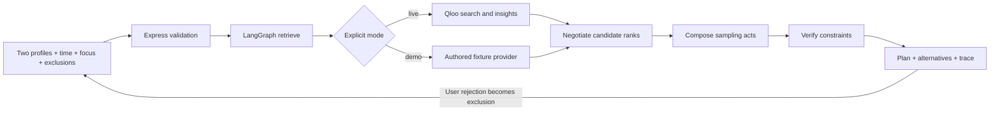

# Architecture

Common Ground is a TypeScript application with a React/Vite client, an Express API and a LangGraph planner. It has no database or model-provider dependency. The server owns Qloo transport; the browser owns the current interactive session.

## Product boundaries

Each of the two profiles supplies one to five cultural seeds. The supported domains are movies, music artists and books. A plan aims for one act per domain; if a category has no eligible candidates, the planner warns and redistributes time across the available categories. If none remain, it returns an explicit error. It does not fabricate a replacement category.

The planning budget is 30, 60 or 90 minutes. Allocated time describes an activity such as listening to tracks or reading a lawful sample, not a work's runtime. The project does not retrieve current prices, opening hours, geographic logistics, availability or rights to access content.

## Qloo adapter

`server/provider.ts` implements a shared `search`/`recommend` interface. Live search uses `/search` with the requested entity domain. Recommendations use `/v2/insights` with `filter.type` and the profile's entity IDs as `signal.interests.entities`. Selected and rejected IDs are also sent through `filter.exclude.entities`, allowing Qloo to return a replenished candidate window after feedback. Local filtering remains a defensive check. Search requests up to 12 entities; insights request up to 20 per list. Live responses are validated for UUID identity, requested category and bounded display metadata before reaching the client. Malformed nonempty responses fail visibly.

One complete plan issues six insights calls: two profiles × three domains. The workflow merges evidence locally rather than asking Qloo to decide interpersonal fairness. Transport sends `X-Api-Key` only from the server to an allowlisted Qloo HTTPS origin. Redirects are rejected. The app shares one provider across requests, limiting upstream work to two active calls, sixteen queued calls and a configurable attempt budget (default 30 in a rolling minute). These are local safety limits, not Qloo's issued quota.

An upstream request has a ten-second timeout and at most two attempts, including the initial call. Transient failures can trigger the bounded retry. An upstream `Retry-After` causes a shared cooldown; waits longer than two seconds fail promptly rather than retrying before the requested pause. The overall server work deadline defaults to 45 seconds. Disconnect/deadline cancellation propagates to queued work, fetches and retry delays. Invalid credentials, malformed responses and other failures remain visible; there is no automatic demo fallback. There is no recommendation cache.

The offline adapter contains a small named-entity fixture collection. A deterministic rotation of fixture ordering makes profile changes testable. This algorithm is synthetic, is not an affinity model and is not evidence of Qloo recommendation quality.

## Agent workflow and score semantics

`server/agent.ts` builds and compiles a LangGraph state graph:

1. **Retrieve:** collect separate recommendation lists for both profiles in each domain.
2. **Negotiate:** union by entity ID, remove selected seeds and explicit exclusions, then score the remaining candidates.
3. **Compose:** take each available category's top candidate, retain up to three alternatives and allocate the exact sampling budget.
4. **Verify:** assert distinct selected IDs, exclusion compliance and the requested total duration.

Feedback invokes the graph again with updated exclusions, including upstream filtering. Ranks therefore describe the current exclusion-filtered response window, not a stable global position. A skip is a hard constraint for this session, not a learned dislike signal. This is a bounded, deterministic planning workflow; it does not contain an LLM, an open-ended autonomous reasoning loop or a hidden model-generated explanation. Its trace is a record of executed graph stages, not private chain-of-thought.

For rank `r` in a returned list of length `n`, the normalized contribution is `(n - r + 1) / n`. A candidate absent from that finite list contributes zero to the local score, meaning unknown fit rather than dislike. With contributions `a` and `b`:

- Balanced score: `0.80 × min(a,b) + 0.20 × (a+b)/2`.
- Adventurous score: `0.45 × min(a,b) + 0.55 × (a+b)/2`.

Ties are broken by entity ID. “Adventurous” relaxes the weight on the weaker profile's rank; it does not measure novelty, actual unfamiliarity or cultural distance. Scores compare candidates within the current returned lists, not across people or sessions. They are not Qloo probabilities, confidence intervals or causal evidence. The UI's reasons describe rank positions and this policy.

## API surface

| Endpoint | Purpose |
| --- | --- |
| `GET /api/config` | Public capabilities and default mode; no key value. |
| `GET /api/search?q=...&type=movie&mode=demo` | Find selectable entities in an explicit mode and domain. |
| `POST /api/plan` | Validate two profiles, mode, minutes, focus and exclusions, then invoke the planner. |

`src/shared.ts` defines client/server contracts. Zod validates incoming requests, including UUIDs for live seed and exclusion IDs. IDs are normalized and deduplicated within each profile and the exclusion list; the same seed may legitimately appear for both people, but conflicting categories for one ID are rejected. Error responses use `{ "error": { "code": "...", "message": "..." } }`; upstream bodies are not relayed as errors. Express applies security headers, a JSON body-size limit and per-client rate limiting.

## Operational limits

The source implementation does not establish authenticated Qloo compatibility. See `VALIDATION.md` for what was actually exercised. API quotas, event access and deployment-specific proxy settings need operator verification. A single successful plan is not a recommendation-quality benchmark. Per-client limits and the shared upstream budget are process-local, not a distributed quota system. Multiple replicas using one credential need a common gateway or shared limiter. Each graph can make six upstream calls and retries can increase this total.

Official technical references: [Qloo documentation mirror](https://github.com/qloo/docs-public), [Qloo hackathon kit](https://github.com/qloo/qloo-hackathon-kit). The kit's preferred harness surfaces are supplemental guidance; confirm the direct-HTTP approach with organizers if their current access requirements require the harness. The formal event requirements and this clarification are tracked in `RULES_REVIEW.md` and `RELEASE_CHECKLIST.md`.

Upstream successful response bodies are streamed with a 2 MiB cap. Error response bodies are cancelled before the shared request slot is released; aborts also cancel stalled streams. These guards avoid leaving connections and memory unbounded on malformed upstream responses.
